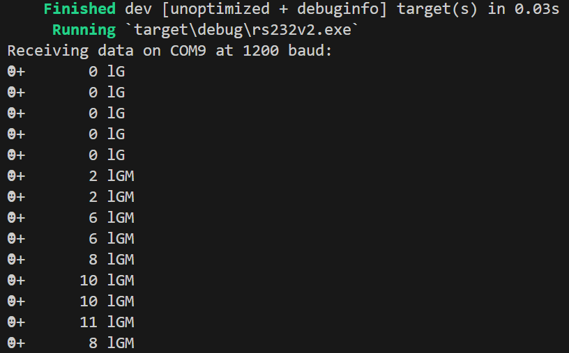
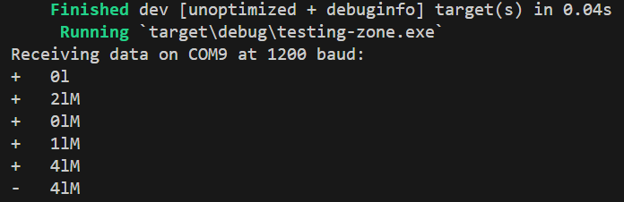
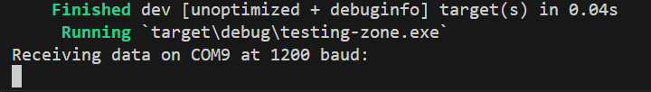
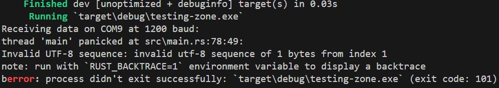

# No clue

##### Expected
<p>How it should look with all of the data displayed (see "straight_docs.rs"):</p>

** Note: Multidigit weight values & G for Gross weight that don't exist via other methods 

##### Actual
When I compile using the manual code one of three things happens:
1. It compiles, opens the port, reads in the polarity, 4 spaces, the last digit of the weight value (12 -> 2) and the unit, gross/net, and motion / stable.


2. It compiles, opens the port, and then does nothing. no code is ever printed and no error messages ever pop up.


3. It compiles, opens the port, immediately crashes with the message of invalid utf-8 character. (the stream is in hexadecimal)



## Current Issue
<p>BufReader returns a string for each line. I don't know if BufReader is automatically converting the hexadecimal into utf-8 / ascii letters and characters.</p>

``` rust
Ok(serial_buf) => {
    if serial_buf != stored_buffer {                       
        println!("{}", serial_buf);
        stored_buffer = &serial_buf; //borrowed value doesn't live long enough
    }
}
```

## End goals

#### Conceptual
<p>When the app launches a new thread is made and a connection is attempted. If the connection fails / stops / needs restarted there is a Tauri command to retry (preferably the same one that is used on app launch).</p>
<p>Data is formatted via the struct / json / I don't care. Then passed to the frontend as an event.</p>
